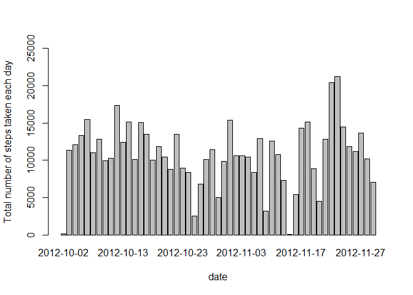
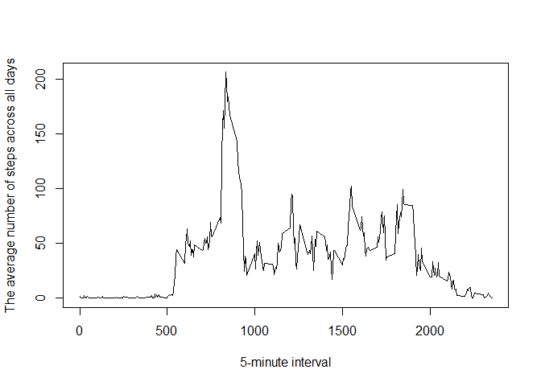
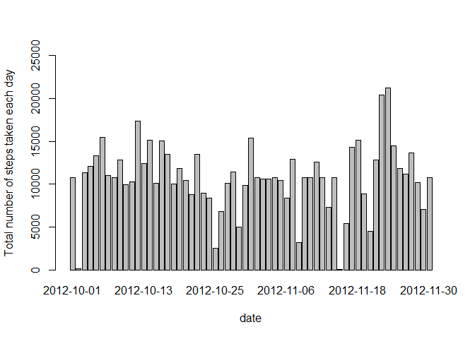
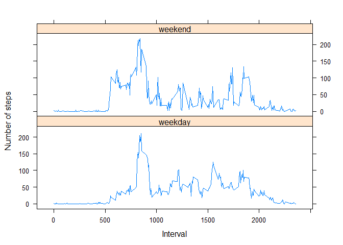

# Reproducible Research: Peer Assessment 1


## Loading and preprocessing the data

```r
activity<-read.csv("activity.csv")
```

## What is mean total number of steps taken per day?
####1.Calculate the total number of steps taken per day

```r
StepsPerDate <- aggregate(formula=steps ~ date,data=activity,FUN=sum)
head(StepsPerDate)
```

```
##         date steps
## 1 2012-10-02   126
## 2 2012-10-03 11352
## 3 2012-10-04 12116
## 4 2012-10-05 13294
## 5 2012-10-06 15420
## 6 2012-10-07 11015
```

####2.Make a histogram of the total number of steps taken each day

```r
barplot(StepsPerDate$steps,names.arg = StepsPerDate$date,ylim=c(0, 25000),
        xlab="date", ylab="Total number of steps taken each day")
```

 

####3.Calculate and report the mean and median of the total number of steps taken per day

```r
mean(StepsPerDate$steps)
```

```
## [1] 10766.19
```

```r
median(StepsPerDate$steps)
```

```
## [1] 10765
```

## What is the average daily activity pattern?
####1.Make a time series plot of the 5-minute interval and the average number of steps taken, averaged across all days 

```r
StepsPerInterval <- aggregate(formula=steps ~ interval,data=activity,FUN=mean)
plot(StepsPerInterval$interval, StepsPerInterval$steps, type="l",
     xlab="5-minute interval", ylab="The average number of steps across all days")
```

 

####2.Which 5-minute interval, on average across all the days in the dataset, contains the maximum number of steps?

```r
StepsPerInterval$interval[which(StepsPerInterval$steps==max(StepsPerInterval$steps))]
```

```
## [1] 835
```

## Imputing missing values

####1.Calculate and report the total number of missing values in the dataset 

```r
good<-complete.cases(activity)
nrow(activity)-nrow(activity[good,])
```

```
## [1] 2304
```
####2.Use the mean for that 5-minute interval for filling in all of the missing values in the dataset,then
Create a new dataset called(FillingDatase) that is equal to the original dataset but with the missing data filled in with the 5-minute interval mean.

```r
FillingDataset <- activity
NA_Index <- is.na(FillingDataset$steps)

Interval_mean <- tapply(FillingDataset$steps, FillingDataset$interval, mean, na.rm=TRUE, simplify=TRUE)
FillingDataset$steps[NA_Index] <- Interval_mean[as.character(FillingDataset$interval[NA_Index])]
head(FillingDataset)
```

```
##       steps       date interval
## 1 1.7169811 2012-10-01        0
## 2 0.3396226 2012-10-01        5
## 3 0.1320755 2012-10-01       10
## 4 0.1509434 2012-10-01       15
## 5 0.0754717 2012-10-01       20
## 6 2.0943396 2012-10-01       25
```

####3.Make a histogram of the total number of steps taken each day

```r
NewStepsPerDate <- aggregate(formula=steps ~ date,data=FillingDataset,FUN=sum)
barplot(NewStepsPerDate$steps,names.arg = NewStepsPerDate$date,ylim=c(0, 25000),
        xlab="date", ylab="Total number of steps taken each day")
```

 

####4.Calculate and report the mean and median total number of steps taken per day.

```r
mean(NewStepsPerDate$steps)
```

```
## [1] 10766.19
```

```r
median(NewStepsPerDate$steps)
```

```
## [1] 10766.19
```
These values  are not significantly differ from the estimates of the first part of the assignment.So, it seems that, there in no impact of imputing missing data on the estimates of the total daily number of steps

## Are there differences in activity patterns between weekdays and weekends?
####1.Create a new factor variable in the dataset with two levels – “weekday” and “weekend” indicating   whether a given date is a weekday or weekend day.
Setting the system time to English

```r
my_lc_time <- Sys.getlocale("LC_TIME")
Sys.setlocale("LC_TIME", "English")
```

```
## [1] "English_United States.1252"
```
**First** Trasform the date into day throug weekdays() function
**Second** Categorize the day to two groups (weekend and weekday)
**Finally** Setup a new variable DayType and add them to the dataset using mutate() function under dplyr package


```r
library(dplyr)
```

```
## Warning: package 'dplyr' was built under R version 3.2.3
```

```
## 
## Attaching package: 'dplyr'
## 
## The following objects are masked from 'package:stats':
## 
##     filter, lag
## 
## The following objects are masked from 'package:base':
## 
##     intersect, setdiff, setequal, union
```

```r
class(FillingDataset$date)<-"Date"
DayType <-ifelse(weekdays(FillingDataset$date) == "Saturday" | weekdays(FillingDataset$date) == "Sunday", "weekend", "weekday")
FillingDataset<-mutate(FillingDataset,DayType)
FillingDataset$DayType <- as.factor(FillingDataset$DayType)
```

```r
head(FillingDataset)
```

```
##       steps       date interval DayType
## 1 1.7169811 1970-01-02        0 weekday
## 2 0.3396226 1970-01-02        5 weekday
## 3 0.1320755 1970-01-02       10 weekday
## 4 0.1509434 1970-01-02       15 weekday
## 5 0.0754717 1970-01-02       20 weekday
## 6 2.0943396 1970-01-02       25 weekday
```

####2.Make a panel plot containing a time series plot of the 5-minute interval (x-axis) and the average number of steps taken, averaged across all weekday days or weekend days (y-axis).

```r
StepsPerInterval_D <- aggregate(formula=steps ~interval+DayType,data=FillingDataset,FUN=mean)
library(lattice)
xyplot(steps ~ interval | DayType, data=StepsPerInterval_D,type="l",layout=c(1,2),
       xlab="Interval", ylab="Number of steps")
```

 
